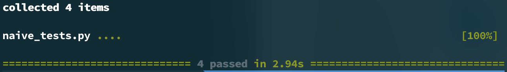
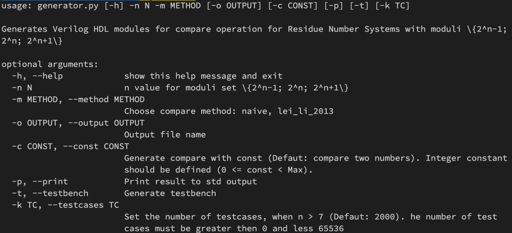

# Руководство разработчика
## 1. Общие сведения о программе
### 1.1 Назначение программы
Программа предназначена для генерации аппаратного описания на языке Verilog HDL функций сравнения в модулярной арифметике. Программа предоставляет возможности выбора базиса модулярной арифметики, типа сравнения и других характеристик выходных данных. Помимо этого программа генерирует модули верификации получаемых аппаратных описаний. 
Для генерации предоставляется выбор между двумя методами сравнения: основанном на переводе сравниваемых чисел в двоичное представление и основанный на предварительном вычитании с последующим переводом результата в двоичное представление. Возможна генерация модуля сравнения с константой одним из доступных методом.
Для применения первого метода сравнения необходимо отдельно получить аппаратное описание модуля быстрого перевода, используя генератор, расположенный в ([свободном доступе в сети “Интернет”](http://vscripts.ru/2012/reverse-converter-2supn-generator.php)
. Для этого метода доступно использованием базисов вида {2<sup>n</sup>-1; 2<sup>n</sup>; 2<sup>n</sup>+1}, где 2 < n < 44. Данный метод позволяет сравнивать числа в диапазоне от 0 до (2<sup>n</sup>-1 * 2<sup>n</sup> * 2<sup>n</sup>+1)-1. Второй из доступных методов также производит сравнение в базисе вида {2<sup>n</sup>-1; 2<sup>n</sup>; 2<sup>n</sup>+1}, где n > 2. Диапазон значений второго метода ограничен значениями от 0 до (2<sup>n</sup>-1 * 2<sup>n</sup> * 2<sup>n</sup>+1) / 2.
В модулях верификации для операции сравнения чисел в базисе с n < 44 применяется случайная генерация тестовых случаев. Число тестовых случаев может быть выбрано в диапазоне от 1 до 65536.

### 1.2 Минимальный состав аппаратных средств

Компьютер с монитором, мышью и клавиатурой, процессор с тактовой частотой 1 ГГц или выше, 2 Гб ОЗУ и выходом в сеть “Интернет”.
Для запуска модулей сравнения на ПЛИС рекомендуется использовать устройство на основе ПЛИС с 100 000 логическими элементами, 5000 Кбит. встроенной памяти.

### 1.3 Минимальный состав программных средств

Операционная система Windows 10 или Ubuntu 18.04 или macOS Mojave 10.14.6. Интерпретатор языка Python версии 3.7 и выше. Интернет браузер Google Chrome 89 или Mozilla Firefox 85 или Apple Safari 14 или аналогичный. Пакеты Python: veriloggen 1.9.1, argparse 1.1, pytest 6.2.2. 
Для проверки работы модулей verilog необходим набор утилит Icarus Verilog 11. Для компиляции, синтеза и запуска модулей с использованием устройства на базе ПЛИС используйте пакет программ, рекомендуемых производителем соответствующего аппаратного обеспечения. 

## 2. Структура программы

### 2.1 Связи с другими программами

Генерация исходных кодов аппаратных описаний производится с использованием стороннего Python модуля  veriloggen. 
Обработка аргументов командной строки производится с использованием стороннего Python модуля  argparse.
Первичная проверка работы программы производится с помощью стороннего Python модуля pytest и набора утилит Icarus Verilog.
Генерацию модулей перевода из модулярной системы счисления в двоичную систему счисления рекомендуется производить с использованием публично доступного ресурса, расположенного по адресу: [vscripts.ru](http://vscripts.ru/2012/reverse-converter-2supn-generator.php).

### 2.2 Состав программы

Программа разделена на 5 модулей, расположенных в отдельных файлах с расширением `.py` в директории `python`:
Функции в файле `naive_compare_generator` отвечают за генерацию модулей сравнения по методу, основанному  на переводе сравниваемых чисел в двоичное представление. Файл содержит 2 функции:
- `create_naive_compare_module` – функция генерации аппаратного описания сравнения двух чисел;
- `create_naive_compare_const_module` – функция генерации аппаратного описания сравнения числа с константой

Функции в файле `Lei_Li_2013_compare_generator` отвечают за генерацию модулей сравнения по методу, основанному на предварительном вычитании с последующим переводом результата в двоичное представление. Файл содержит 5 функций:
- `create_lei_li_2013_compare_module` – функция генерации аппаратного описания сравнения двух чисел;
- `create_lei_li_2013_compare_const_module` – функция генерации аппаратного описания сравнения числа с константой;
- `create_subtracting_modules` – функция генерация аппаратного описания модулярного вычитания;
- `create_csa_with_eac_module` – функция генерация аппаратного описания сумматора с сохранением переноса и циклическим возвратом переноса;
- `create_binary_adder_module` – функция генерация аппаратного описания двоичного сумматора.

Функции в файле `testbench_generator` отвечают за генерацию модулей верификации. Файл содержит 6 функций:
- `create_compare_testbench` – функция генерации модуля верификации аппаратного описания сравнения двух чисел;
- `create_compare_const_testbench` – функция генерации модуля верификации аппаратного описания сравнения чисела с константой;
- `create_full_compare_const_testbench` – функция генерации модуля верификации аппаратного описания сравнения чисела с константой с проверкой всех чисел в доступном диапазоне;
- `create_full_compare_testbench` – функция генерации модуля верификации аппаратного описания сравнения двух чисел с проверкой всех чисел в доступном диапазоне;
- `create_small_compare_const_testbench` – функция генерации модуля верификации аппаратного описания сравнения чисела с константой с проверкой ограниченного случайного набора чисел в доступном диапазоне;
- `create_small_compare_testbench` – функция генерации модуля верификации аппаратного описания сравнения двух чисел с проверкой ограниченного случайного набора чисел в доступном диапазоне.

Файл `pretty_print` содержит единственную одноименную функцию, отвечающую за форматирование генерируемого исходного кода и исключение лишних пустых модулей, получаемых в процессе автоматической генерации. 
Основной файл `generator` содержит единственную функцию `main`, отвечающую за обработку входных аргументов и запуск необходимых функций в соответствии с запросом пользователя.

## 3. Настройка программы

Перед проверкой и запуском программы необходимо убедиться, что установлены все необходимые программные средства. Для установки модулей `Python` рекомендуется использовать встроенную утилиту управления пакетами `Python pip`. Необходимо убедиться, что установленные программные средства (интерпретатор языка `Python`, набор утилит `Icarus Verilog`) добавлены в переменную среды PATH и доступны для вызова из командной строки, а также убедиться в наличии необходимых прав доступа к директориям, которые содержат исходный код программного продукта.

## 4. Проверка программы

Для проверки программы используется интерпретатор языка `Python`, модуль тестирования `PyTest` и набор утилит `Icarus Verilog`. Перед запуском проверки необходимо перейти в директорию, содержащую исходный код программы, с использованием командной строки. После этого необходимо переместиться в поддиректорию `tests` и выполнить следующие команды:

#### MacOS:
```
python3 -m pytest naive_tests.py
python3 -m pytest lei_li_2013_tests.py
```

#### Linux/Windows:
```
pytest naive_tests.py
pytest lei_li_2013_tests.py
```

## 5. Сообщения системному программисту

### 5.1 Сообщения, выдаваемые в ходе проверки программы

В ходе проверки программы может быть обнаружено, что отсутствует один из необходимых модулей Python. В этом случае будет выведено сообщение следующего вида:

```
ModuleNotFoundError: No module named 'module'
```

В этом случае необходимо убедиться, что установлены все необходимые модули (в том числе те, которые необходимы для работы модулей, перечисленных в минимальном составе программных средств). Для устранения данной неполадке воспользуйтесь утилитой установки пакетов Pyhton pip. 

Также может быть обнаружено отсутствие одной или нескольких требуемых утилит, либо невозможность вызова их из командной строки. В этом случае будет выведено сообщение вида (сообщение может отличаться в зависимости от используемой операционной системы, либо в зависимости от использованного командного интерпретатора):

```
command not found: util
```

В этом случае рекомендуется проверить, была ли установлена соответствующая утилита согласно рекомендациям разработчиков, после чего проверить наличие утилиты в переменной среды `PATH` вашей операционной системы.
В случае успешного выполнения проверки, после каждой из команд проверки, будет выведено сообщение вида: 



### 5.2 Сообщения, выдаваемые в ходе выполнения программы

При выборе параметра вывода краткой справки выводится следующее сообщение: 



При пропуске обязательного параметра будет выведено сообщение:

```
error: the following arguments are required: [mandatory param]
```

Требуется перезапуск программы с использованием всех необходимых параметров.
При выборе некорректного метода или n для базиса, либо некорректной константы для сравнения, либо некорректного число тестовых случаев будет выведено сообщение, указывающее диапазон возможных значений соответствующего параметра. Аналогичное поведение программы происходит при выборе неверного пути  выходному файлу. Например: 

```
n must be greater than 3
```

Необходимо устранить ошибку и перезапустить программу.
При успешном завершении генерации вывод сообщение не производится, кроме случая выбора флага печати результата в стандартный поток вывода.
